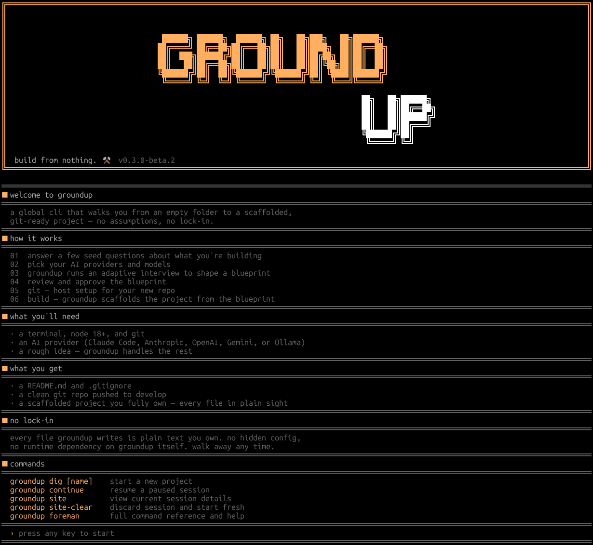

# groundup



> build from nothing. ■

A global CLI tool that takes a developer from an empty folder to a fully scaffolded, blueprint-approved project — without ever leaving the terminal. Interview-first. Stack-agnostic. No assumptions. Ever.

---

## Install

```bash
# from npm (recommended)
npm install -g groundup-cli@beta

# from source
git clone https://github.com/devvJS/groundup-cli
cd groundup-cli
npm install
npm link
```

## Usage

```bash
groundup dig my-project
```

That's it. groundup takes it from there.

---

## The flow

| Phase | What happens |
|-------|-------------|
| 01 Interview | groundup asks about your product — purpose, users, features, constraints. Adaptive. Never asks what's irrelevant. |
| 02 Agent | What AI are you building with? Shapes recommendations and determines which context file gets generated. |
| 03 Stack | Layer by layer. Recommends with reasoning. Developer confirms every choice. Nothing assumed. |
| 04 Blueprint | groundup writes BLUEPRINT.md — your full project spec. Purpose, users, permissions, features, stack, open decisions. |
| 05 Approval | Hard stop. Developer reads the blueprint and approves. Nothing gets built until they say yes. |
| 06 Repo | Git hosting selection — GitHub, GitLab, Bitbucket, self-hosted, or skip. Creates the repo without leaving terminal. |
| 07 Build | groundup scaffolds the project, configures services, writes .env.example with every variable documented. |

---

## Commands

| Command | Description |
|---------|-------------|
| `groundup dig [name]` | Start a new project — the hero command |
| `groundup continue` | Resume a paused session |
| `groundup down` | Pause and save — tools down |
| `groundup plans` | View BLUEPRINT.md |
| `groundup plans revise` | Edit BLUEPRINT.md |
| `groundup plans redraw` | Regenerate blueprint from scratch |
| `groundup inspect` | Current build phase and progress |
| `groundup raise` | Resume an interrupted build |
| `groundup site` | View current session details |
| `groundup site-clear` | Discard session and start fresh |
| `groundup site history` | All past groundup projects |
| `groundup foreman` | Full command reference |
| `groundup foreman [cmd]` | Contextual help for one command |
| `groundup version` | Current version and changelog |

## Keyboard shortcuts

| Key | Action |
|-----|--------|
| `ctrl+p` | Pause and save anywhere mid-session |
| `ctrl+c` | Exit — prompts save before quit |
| `?` | Foreman help at any prompt |
| `↑ ↓` | Navigate options |
| `space` | Select option |
| `enter` | Confirm and move forward |

---

## Design principles

**No assumptions. Ever.**
groundup never scaffolds, installs, configures, or recommends anything the developer did not explicitly confirm.

**Stay in the terminal.**
groundup never pulls a developer out of their flow mid-session. Any step that requires a browser is deferred to the post-build checklist.

**Blueprint before build.**
Nothing gets scaffolded until the developer has read BLUEPRINT.md and approved it. The spec is the contract. The approval gate is the handshake.

**Sessions survive real life.**
ctrl+p saves everything — interview answers, stack decisions, blueprint state. groundup continue picks up exactly where you left off.

**Every developer is covered.**
Senior devs move fast. Junior and AI-dependent devs hit ? at any prompt and get a plain-language explanation of the concept, a comparison of options, and a concrete recommendation tailored to their specific project.

---

## What groundup produces

| File | Description |
|------|-------------|
| `BLUEPRINT.md` | The spec, the contract, the source of truth |
| `WORKORDER.md` | The ordered build plan the agent executes |
| `CLAUDE.md` | Project context for Claude Code (or equivalent for your agent) |
| `.env.example` | Every environment variable named, typed, and documented |
| `.groundup/` | Session state — interview answers, stack decisions, build progress |

---

## Stack support

groundup is stack-agnostic. It supports any combination of:

**Frontend:** Next.js, Remix, Nuxt, SvelteKit, Astro, Angular, Vue, React, Vanilla JS, HTML+CSS

**Mobile:** Expo, React Native CLI, Flutter, Ionic

**Backend:** Node.js + Express / Fastify / Hono, Python + Django / FastAPI / Flask, Ruby on Rails, Java + Spring Boot, C# + .NET, Go + Gin / Echo, Rust + Axum, PHP + Laravel

**Database:** PostgreSQL, MySQL, SQLite, MongoDB, Supabase, Neon, PlanetScale, Firebase, Redis, DynamoDB

**Auth:** Clerk, Supabase Auth, NextAuth, Firebase Auth, Passport.js, Devise, Django Auth, ASP.NET Identity

**Payments:** Stripe, Lemon Squeezy, Paddle, Braintree

**CMS:** Sanity, Contentful, Payload, Keystatic, Strapi, WordPress

**Deployment:** Vercel, Railway, Fly.io, Render, AWS, GCP, Azure, Cloudflare, Heroku, DigitalOcean

---

## Agent support

groundup is agent-agnostic. Select your AI and groundup generates the right context file:

| Agent | Context file |
|-------|-------------|
| Claude Code | `CLAUDE.md` |
| Cursor | `.cursorrules` |
| OpenAI Codex | `AGENTS.md` |
| Gemini CLI | `GEMINI.md` |
| GitHub Copilot | `.github/copilot-instructions.md` |
| Other | `AGENT.md` |

---

## Positioning

> BMAD is for teams building enterprise software.
> groundup is for one developer with an idea and an empty folder.

---

## License

MIT — see [LICENSE](LICENSE)

---

## Contributing

groundup is open source and early. If you have ideas, find bugs, or want to add stack support — PRs welcome.

```bash
git clone https://github.com/devvJS/groundup-cli
cd groundup-cli
npm install
npm link
groundup dig my-project
```

---

*happy building. ■*